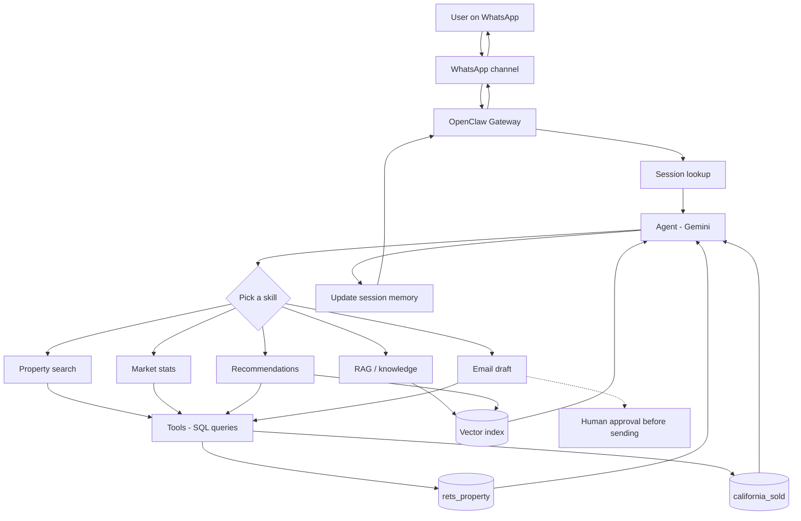

# Architecture

Week 1 writeup. How a message gets from WhatsApp to the MLS data and back, and what each OpenClaw piece does.

## Flow

## How it works

The **Gateway** is a background process running on my machine (bound to localhost only). Every message goes through it, and itpasses through it, and it handles channel connections and tracks handles channel connections and keeps track of sessions.

Each user gets their own **session**, which stores their conversation history. It's what lets follow-ups work later on. Messages in a session run one at a time so two requests don't step on each other.

The **agent** takes the message and sends it to the LLM (I'm going with Gemini for now). The LLM looks at the available **skills** and picks one. In OpenClaw a skill is a folder with a `SKILL.md` that describes what it does, and the model chooses based on those descriptions. The handbook example uses a keyword check, but in practice the routing comes from the model reading the descriptions, so they need to be written clearly.

Skills call **tools**, which are the actual functions that hit the database. The model only fills in parameters (city, max price, etc). It never writes SQL itself, and all queries are parameterized.

**Memory** is two things: short-term session history (saved by OpenClaw as JSONL files), and long-term embeddings for listing descriptions and reference docs (weeks 6 and 8).

## Data

- `rets_property`: active listings (~55k rows). Used for search and recommendations.
- `california_sold`: past sales 2021-2025 (~98k rows). Used for market stats and checking prices against comps.

They join on `L_ListingID` = `ListingKey`, or by city/zip for market-level stuff. Heads up that `rets_property` uses some legacy column names: `L_SystemPrice` is price, `L_Keyword2` is beds, `LM_Dec_3` is baths, `LM_Int2_3` is sqft.

The handbook calls the database `boxgra5_cali`. Mine is called `idx_exchange`.
